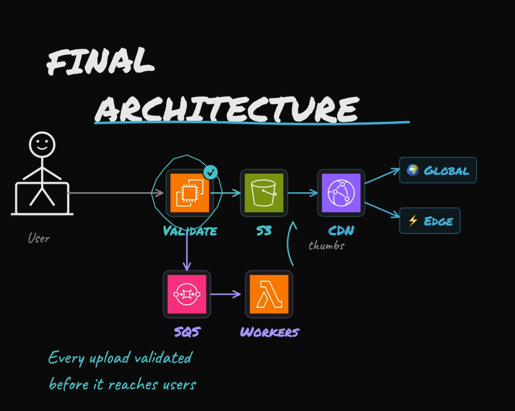

# Document Ingestion Architecture

## Why direct API file upload becomes a bottleneck

If clients send full document binaries to the API service, the API tier carries both:

- control-plane work (auth, validation, routing, task creation), and
- data-plane work (high-volume file transfer).

At high concurrency, this creates pressure on API bandwidth, request handling capacity, and retry paths. The system can still process tasks asynchronously with RabbitMQ and Celery, but ingestion throughput is constrained by the web API layer before workers become the limit.

### Capacity framing (example)

Use this quick model during planning:

- `concurrent_uploads = active_users * upload_ratio`
- `ingress_bytes = concurrent_uploads * avg_file_size`
- `required_ingress_mbps = (ingress_bytes * 8) / upload_window_seconds / 1_000_000`

Example:

- `active_users = 1,000,000`
- `upload_ratio = 0.10`
- `avg_file_size = 1 MB`
- `upload_window_seconds = 300` (5 min burst)

Then:

- `concurrent_uploads = 100,000`
- `ingress_bytes = 100,000 MB` (~100 GB)
- `required_ingress_mbps ~= 2,667 Mbps` (~2.67 Gbps)

This is the reason file transfer should bypass the API tier.

## Production-grade ingestion pattern

Use object storage for the data plane and keep the API for control flow:

1. Client calls `POST /uploads/init`.
2. API creates an `upload_id` and returns a short-lived pre-signed upload URL (SAS).
3. Client uploads the file directly to object storage (multipart/resumable where supported).
4. Client calls `POST /uploads/{upload_id}/complete`.
5. API verifies object existence and integrity metadata (size/checksum/etag), persists state, then enqueues processing.

This removes large payload transfer from the API tier and scales ingestion independently from request orchestration.

## State model and idempotency

Track upload lifecycle explicitly in the database:

- `INITIATED`
- `UPLOADED`
- `CONFIRMED`
- `PROCESSING`
- `FAILED` / `EXPIRED`

`/complete` must be idempotent so retries are safe and do not duplicate tasks.

## Handling incomplete and abandoned uploads

Two gaps must be handled: unfinished uploads and uploaded files that never reach completion confirmation.

Use both of these controls:

- Object storage lifecycle rule: auto-delete unconfirmed objects after a TTL.
- Reconciliation job: scan stale records, verify storage reality, mark `EXPIRED` or advance state when possible.

Optional hardening:

- Consume storage `ObjectCreated` events to mark `UPLOADED` even when client completion calls fail.
- Correlate every upload with a stable trace/correlation id for observability and recovery.

## Metrics to run this in production

Track these as first-class SLO/SLA indicators.

### Ingestion metrics

- `upload_init_rps`
- `upload_complete_rps`
- `direct_upload_success_rate` (storage-side)
- `p95_init_latency_ms`, `p95_complete_latency_ms`
- `ingested_bytes_per_min`

### Reliability metrics

- `complete_idempotency_replay_count`
- `upload_verification_failure_rate` (checksum/size mismatch)
- `orphan_upload_rate` = `expired_unconfirmed_uploads / initiated_uploads`
- `reconciliation_recovery_rate` (stale records auto-recovered)

### Queue and worker metrics

- `queue_depth_{process,ocr,extract,postprocess}`
- `queue_oldest_message_age_seconds`
- `task_end_to_end_p95_seconds` (init -> final result)
- `worker_failure_rate` and `retry_rate`

### Suggested starting targets

- `direct_upload_success_rate >= 99.9%`
- `p95_complete_latency_ms < 500 ms` (control-plane API only)
- `orphan_upload_rate < 0.5%` before reconciliation, `< 0.1%` after reconciliation
- `queue_oldest_message_age_seconds < 60` under normal load
- `task_end_to_end_p95_seconds` defined per document class and file size tier

Tune targets by region, object storage class, and expected document sizes.

## Recommended baseline for this system

For FastAPI + RabbitMQ + Celery, the preferred baseline is:

- pre-signed direct upload,
- idempotent completion endpoint,
- explicit upload state machine,
- lifecycle cleanup + reconciliation.

This preserves your existing async processing pipeline while removing the highest-risk ingestion bottleneck.

## Resources

### Image Upload Pipeline

Source: [KodeKloud: Building a Robust Image Upload Pipeline! 🚀](https://www.facebook.com/reel/2710332429345077)
