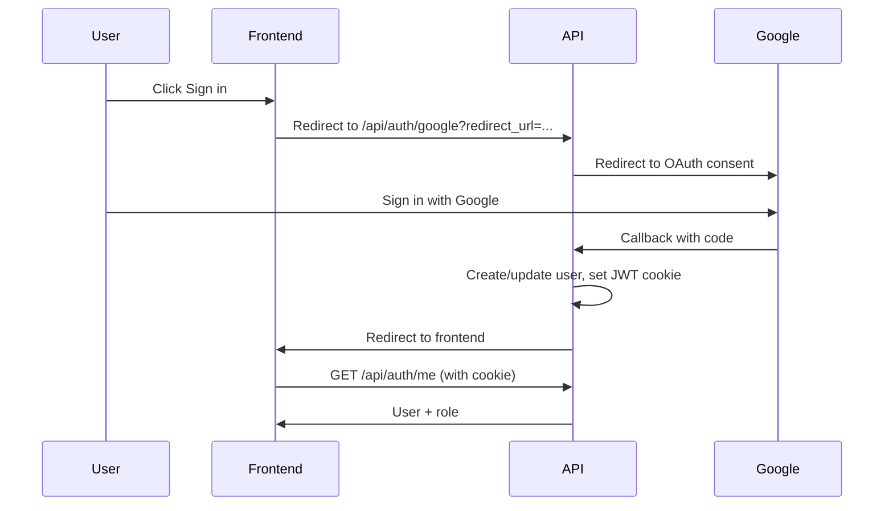
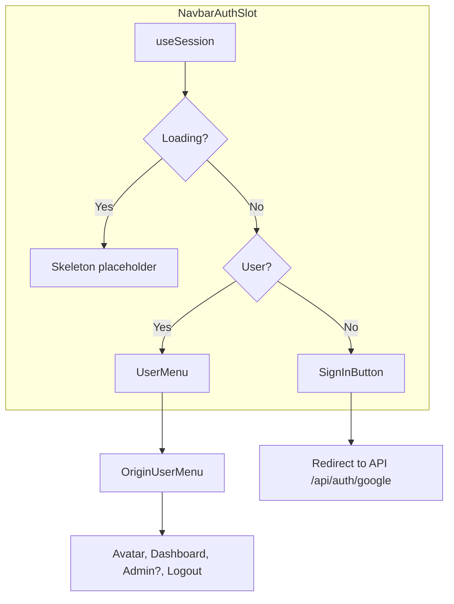
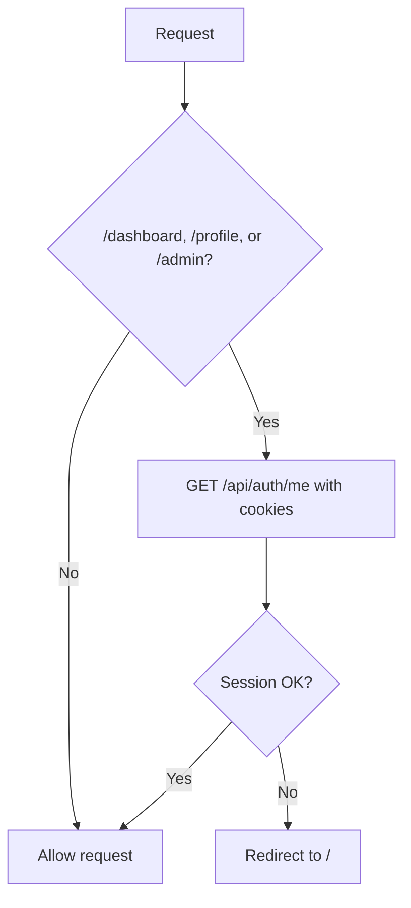

# Auth Architecture Overview

Google OAuth + JWT in httpOnly cookie. No email/password, no registration form. This document describes the auth architecture for both frontend and backend.

---

## Overview

| Component | Details |
|-----------|---------|
| **Provider** | Google OAuth only |
| **Session** | JWT in httpOnly cookie |
| **Role** | In JWT payload (`user`, `admin`) |
| **Flow** | Frontend redirects to API → API redirects to Google → callback returns to API → API sets cookie and redirects to frontend |

---

## Endpoints

| Endpoint | Method | Purpose |
|----------|--------|---------|
| `/api/auth/google` | GET | Redirect user to Google OAuth consent screen |
| `/api/auth/google/callback` | GET | Handle callback, create/update user, set session cookie, redirect to frontend |
| `/api/auth/me` | GET | Return current user (session check) |
| `/api/auth/logout` | POST | Clear session cookie |

---

## Auth Flow



---

## Component Flow



---

## Protected Routes



---

## Backend Configuration

### Google Cloud Setup

1. Go to [Google Cloud Console](https://console.cloud.google.com/) → APIs & Services → Credentials
2. Create OAuth 2.0 Client ID (Web application)
3. Add authorized redirect URI (must be the **frontend** URL when API is proxied via Next.js):
   - Prod: `https://example.com/api/auth/google/callback` (and `https://www.example.com/...` if using www)
   - Dev: `http://localhost:3000/api/auth/google/callback`
4. Store `GOOGLE_CLIENT_ID`, `GOOGLE_CLIENT_SECRET`, `JWT_SECRET_KEY`, `SESSION_SECRET_KEY`, and `FRONTEND_URL` in `.env`. When the API is proxied (Next.js rewrites), `FRONTEND_URL` is required so the OAuth state cookie is set for the frontend domain (fixes `MismatchingStateError` on Vercel).

### Cookie Settings

- `httpOnly=True`
- `secure=True` (when HTTPS)
- `samesite="lax"`
- `path="/"`

### CORS

Backend must allow credentials and frontend origins:

```
allow_credentials=True
allow_origins=["https://example.com", "http://localhost:3000"]
```

---

## Frontend Configuration

- **API base URL** — Frontend needs the API base (e.g. `http://localhost:8000` for dev, `https://api.example.com` for prod) to build full URLs for auth endpoints.
- **Credentials** — All requests to `/api/auth/me` and other protected endpoints must include credentials (cookies) so the httpOnly cookie is sent.

---

## Models

### User

| Field | Type |
|-------|------|
| id | UUID |
| email | string |
| name | string |
| image | string? |
| is_active | boolean |
| role | enum (user, admin) |
| created_at | datetime |
| updated_at | datetime |

### Account (OAuth linking)

| Field | Type |
|-------|------|
| id | UUID |
| user_id | UUID |
| provider_id | string (google) |
| provider_account_id | string |
| created_at | datetime |
| updated_at | datetime |
