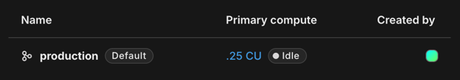
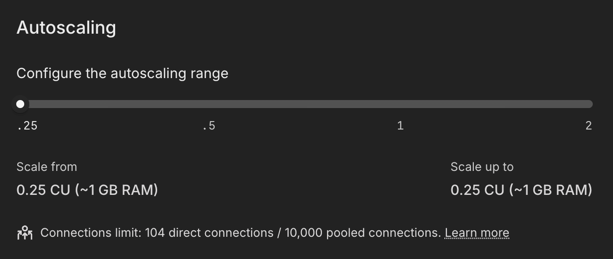

# Neon Database

PostgreSQL hosted on [Neon](https://neon.tech) for production.

---

## Primary Compute — Cost Optimization

By default, Neon sets **Primary compute** to autoscale from **0.25 CU** up to **2 CU**. This range consumes more CU-hours and can exceed the free tier limit.

**Fix:** Set both the minimum and maximum to **0.25 CU** so the compute stays fixed at the minimum.

### Autoscaling Configuration

In the Neon dashboard → your project → **Autoscaling**:

1. Set **Scale from** to `0.25 CU (~1 GB RAM)`
2. Set **Scale up to** to `0.25 CU (~1 GB RAM)`

This keeps the database within the free tier CU-hour allowance.
